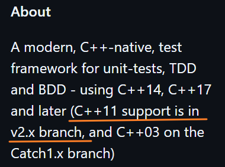

# Catch2_model
According to Catch2 official website `https://github.com/catchorg/Catch2`, write a use case

# 版本选择

根据版本推荐,我们使用Catch2的v2.x版本

我们将Catch2作为子模块,所以,

你在克隆本项目时,除了要执行`git clone git@github.com:1AoB/Catch2_model.git`,

你还需要执行` git submodule update --init --recursive`来初始化子模块Catch2的v2.x版本.

# Excellent Git training opportunity!

Below, I will write:

How to use the v2.x version of Catch2 library as a submodule for this project:

1. cd Catch2_model
2. git submodule add https://github.com/catchorg/Catch2.git Catch2   此时会生成子模块的配置文件.gitmodules
3. cd Catch2
4. git checkout v2.x   此时再去上传就是v2.x这个版本了
5. cd .. 
6. git add Catch2
7. git commit -m "Added Catch2 submodule locked to v2.x branch"
